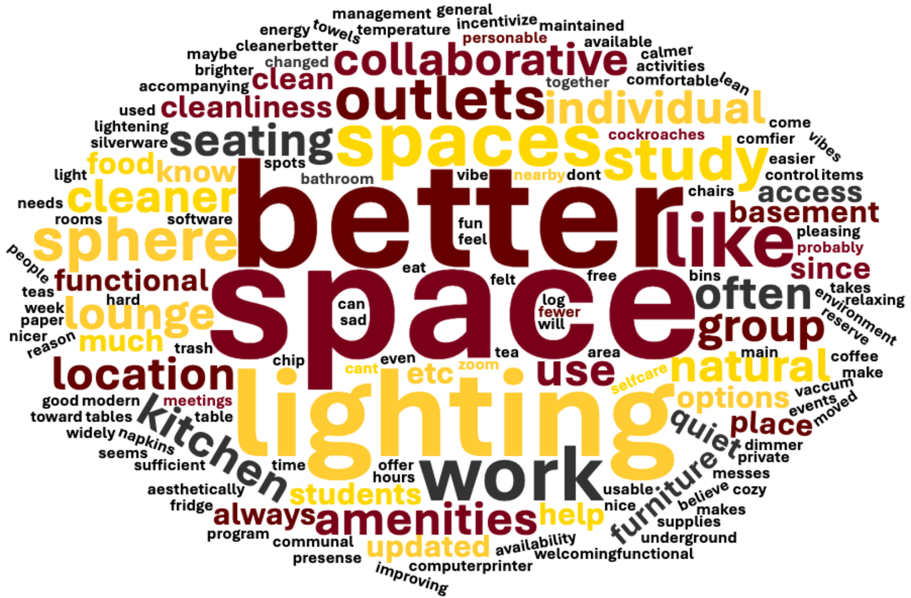
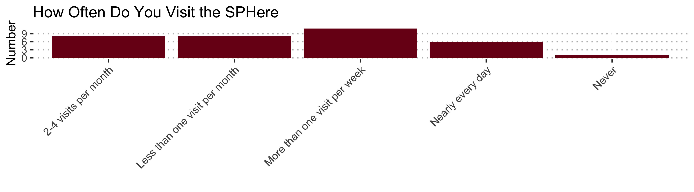
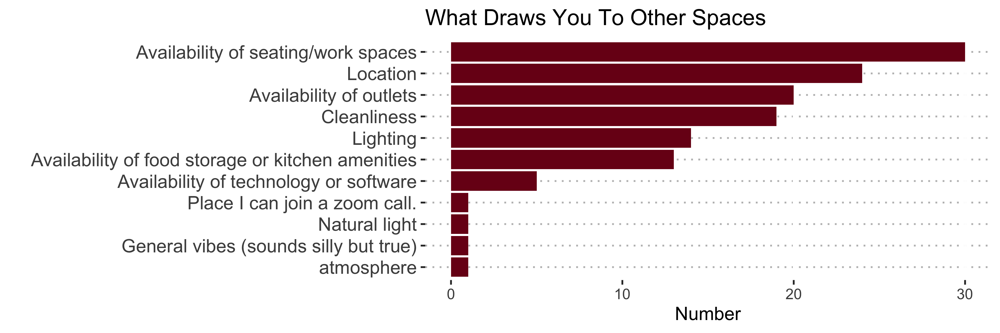
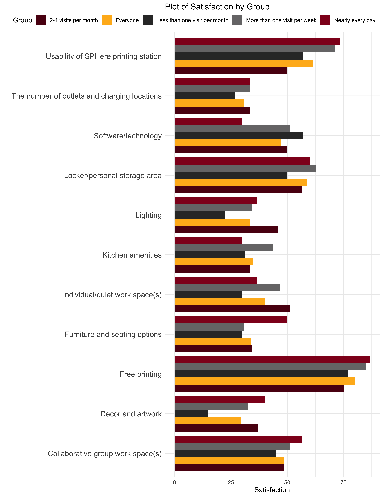
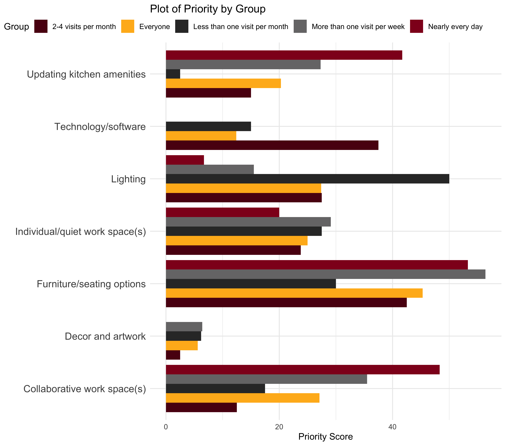

# SPHere Survey Results
Jonathan Barnes, Maya Koffski, Caylin Crawford

  
  
  
  
  
  

# Summary

The survey had 34 responses over the course of 25 days with everyone who
responded being a SPH Student. Of those 34, at least 17 people visit the
SPHere lounge once a week. Overall the responding students satisfaction
with the space is moderate and most put between three and four (3.2
average) out of five when describing if they believe the lounge suits
their needs.

Highlights of what students are satisfied with were free printing, the
printing station, and Lockers/personal storage. 5 categories had lower
satisfaction scores (listed in decreasing order); kitchen amenities,
lighting, furniture, decor/artwork, and number of outlets.

Based on the priority scoring students consistently would like to see
better furniture as a primary change. Secondary priorities should be
lighting, collaborative work spaces, and independent work spaces. An
important mention is that while kitchen amenities as a whole were not a
top priority, for those who use the lounge daily it was a top priority.

## Results and aspects by use frequency

### Satisfaction

- Lack of proper outlets is consistent across groups
- Decor satisfaction decreased as use frequency decreased
- For those who use the lounge daily they are most dissatisfied with
  available technology and kitchen amenities with lighting, outlets, and
  private work space being close. This group however wasn’t as
  dissatisfied with furniture

### Priorities

- Importance of improving available technology is lower however in those
  who visit between 2-4 times a month it is their second highest
  priority. For those who included technology all but one had it as
  their highest.
- Lighting is a consistent priority across groups; in those that visit
  less then once a month it is their highest importance by a considerable
  margin. Shows possible reason for avoiding the lounge.
- Priorities for those who use the lounge daily are furniture,
  collaborative space, and kitchen.

  
  
  
  
  
  
  
  
  
  
  
  
  
  

# Plots and Charts

| 2-4 visits per month | Less than one visit per month | More than one visit per week | Nearly every day | Never |
|:---------------------|:------------------------------|:-----------------------------|:-----------------|:------|
| 8.00                 | 8.00                          | 11.00                        | 6.00             | 1.00  |
| 23.53                | 23.53                         | 32.35                        | 17.65            | 2.94  |

# Satisfaction (Out of 100)

|                                              | Everyone | Nearly every day | More than one visit per week | 2-4 visits per month | Less than one visit per month |
|:---------------------------------------------|---------:|-----------------:|-----------------------------:|---------------------:|------------------------------:|
| Free printing                                |     80.0 |             86.7 |                         85.0 |                 75.0 |                          77.1 |
| Usability of SPHere printing station         |     61.5 |             73.3 |                         71.1 |                 50.0 |                          57.1 |
| Locker/personal storage area                 |     58.9 |             60.0 |                         62.9 |                 56.7 |                          50.0 |
| Collaborative group work space(s)            |     48.4 |             56.7 |                         51.1 |                 48.6 |                          45.0 |
| Individual/quiet work space(s)               |     40.0 |             36.7 |                         46.7 |                 51.4 |                          30.0 |
| Software/technology                          |     47.2 |             30.0 |                         51.4 |                 50.0 |                          57.1 |
| Kitchen amenities                            |     34.8 |             30.0 |                         43.6 |                 33.3 |                          31.4 |
| The number of outlets and charging locations |     30.7 |             33.3 |                         33.3 |                 33.3 |                          26.7 |
| Lighting                                     |     33.3 |             36.7 |                         34.5 |                 45.7 |                          22.5 |
| Decor and artwork                            |     29.4 |             40.0 |                         32.7 |                 37.1 |                          15.0 |
| Furniture and seating options                |     33.9 |             50.0 |                         30.9 |                 34.3 |                          30.0 |

# What Should be Prioritized

|                                | Everyone | Nearly every day | More than one visit per week | 2-4 visits per month | Less than one visit per month |
|:-------------------------------|---------:|-----------------:|-----------------------------:|---------------------:|------------------------------:|
| Collaborative work space(s)    |     27.1 |             48.3 |                         35.5 |                 12.5 |                          17.5 |
| Individual/quiet work space(s) |     25.0 |             20.0 |                         29.1 |                 23.8 |                          27.5 |
| Furniture/seating options      |     45.3 |             53.3 |                         56.4 |                 42.5 |                          30.0 |
| Technology/software            |     12.4 |              0.0 |                          0.0 |                 37.5 |                          15.0 |
| Updating kitchen amenities     |     20.3 |             41.7 |                         27.3 |                 15.0 |                           2.5 |
| Decor and artwork              |      5.6 |              0.0 |                          6.4 |                  2.5 |                           6.2 |
| Lighting                       |     27.4 |              6.7 |                         15.5 |                 27.5 |                          50.0 |

# Weighting Methods and Data Processing

### Weighting

To understand priorities and satisfaction more effectively I chose to
weight the “very” responses and the higher priorities more heavily.

This meant for satisfaction I assigned those who responded very
dissatisfied 0, dissatisfied 40, satisfied 60, and very satisfied 100.
Those who replied “Not Applicable” were assigned an NA.

For priority I assigned third priorities 20, second priorities 50, and
highest priorities as 100, blank answers were assigned 0.

### Data Processing

All analysis and creation of visuals were performed in R. The code for
the processing, cleaning, and writing of this doc can be found in the folder.
